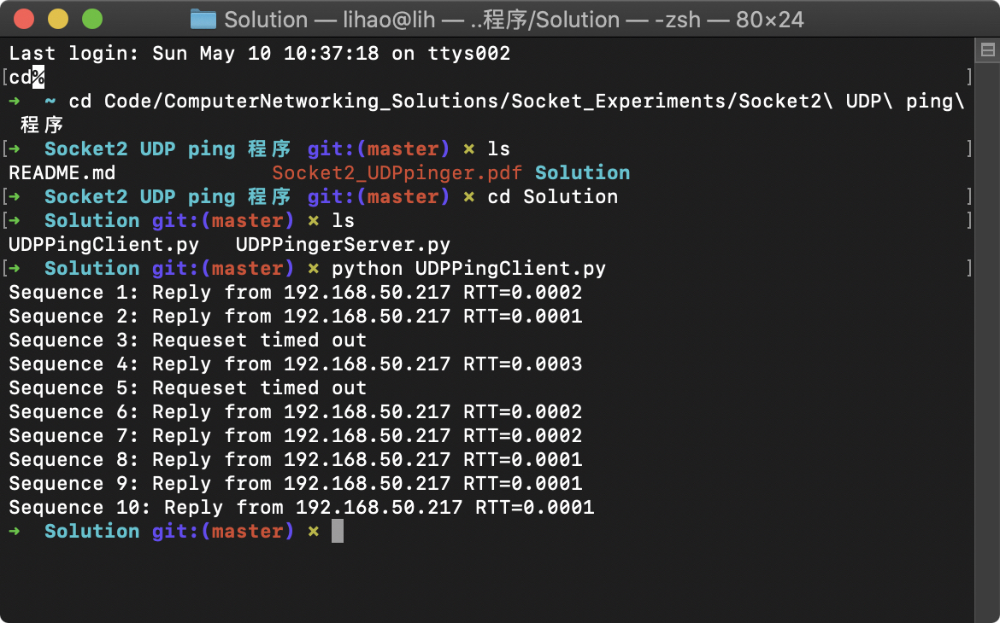
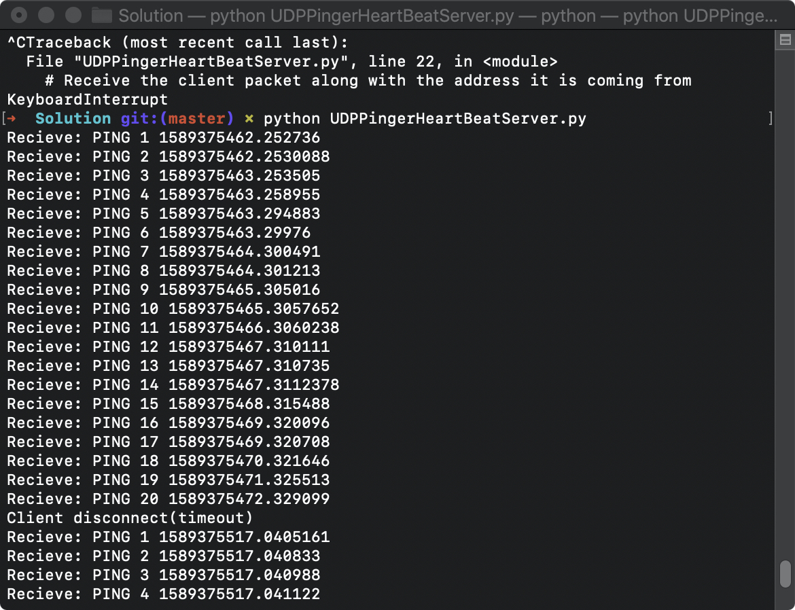
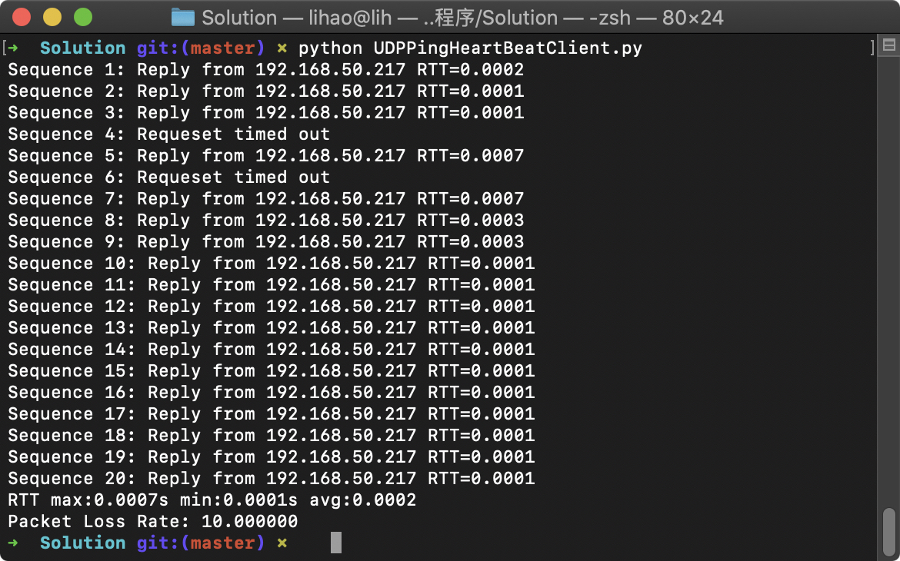

# 作业要求

本实验学习关于 UDP 的基本套接字编程. 包括接受和发送数据报(datagram), 并且如何设定适当的 timeout 时间. 首先会学习简单的 Ping 服务器, 并实现与之对应的客户端. 注意本实验使用的是 UDP 协议而不是 ICMP 协议.

>Ping 的定义:
>
>The ping protocol allows a client machine to send a packet of data to a remote machine, and have the remote machine return the data back to the client unchanged (an action referred to as echoing). Among other uses, the ping protocol allows hosts to determine round-trip times to other machines.


# Server Code

该代码不需要修改

```python
# UDPPingerServer.py 
# We will need the following module to generate randomized lost packets import random 
from socket import *
import random

# Create a UDP socket 
# Notice the use of SOCK_DGRAM for UDP packets 
serverSocket = socket(AF_INET, SOCK_DGRAM)
# Assign IP address and port number to socket 
serverSocket.bind(('', 12000))

while True:

    # Generate random number in the range of 0 to 10 
    rand = random.randint(0, 10)
    # Receive the client packet along with the address it is coming from 
    message, address = serverSocket.recvfrom(1024)
    # Capitalize the message from the client
    message = message.upper()
    # If rand is less is than 4, we consider the packet lost and do not respond 
    if rand < 4:
        continue
        # Otherwise, the server responds 
    serverSocket.sendto(message, address)

```

`random.randint`用于服务器模拟丢包的情况.


# Client Code

由于 UDP 是不可靠的协议, 客户端需要发送 10 个 ping到服务端, 同时由于存在丢包, 不能够无期限等待 UDP 服务器的响应. 需要设定等待时间没 1 秒,如果超时未收到响应, 则假设数据报在传输过程中丢失. 需要查阅 python 手册来学习如何设定 timeout 值.

具体功能总结如下

1. 使用 UDP 发送 Ping, 不同于 TCP, UDP 不需要提前建立链接.
2. 如果收到回应, 将其打印出来
3. 将 RTT 以秒为单位打印出来(只针对收到相应的结果)
4. 对于未收到相应的情况, 打印 "Request timed out"

## Message Format

客户端消息为一行, ASCII 字符

```
Ping sequence_number time
```

`sequence_number`从1开始一直到 10. `time`为客户端发送消息的时间


# 代码与运行结果

```python
from socket import *
import time

serverName = '192.168.50.217'
serverPort = 12000
timeoutValue = 1

clientSocket = socket(AF_INET, SOCK_DGRAM)
clientSocket.settimeout(timeoutValue)

for idx in range(10):
    sendTime = time.time()
    message = "Ping {} {}".format(idx + 1, sendTime)
    try:
        clientSocket.sendto(message.encode(), (serverName, serverPort))
        modifiedMessage, serverAddress = clientSocket.recvfrom(1024)
        rtt = time.time() - sendTime
        print('Sequence {}: Reply from {} RTT={:.4f}'.format(idx + 1,
                                                             serverName,
                                                             rtt))
    except Exception as e:
        print('Sequence {}: Requeset timed out'.format(idx + 1))
clientSocket.close()

```

运行结果截图如下



# 可选实验

> Another similar application to the UDP Ping would be the UDP Heartbeat. The Heartbeat can be used to check if an application is up and running and to report one-way packet loss. The client sends a sequence number and current timestamp in the UDP packet to the server, which is listening for the Heartbeat (i.e., the UDP packets) of the client. Upon receiving the packets, the server calculates the time difference and reports any lost packets. If the Heartbeat packets are missing for some specified period of time, we can assume that the client application has stopped. Implement the UDP Heartbeat (both client and server). You will need to modify the given UDPPingerServer.py, and your UDP ping client.

`HeartBeat`指的是监听来自客户端额心跳.  当接收到数据报后, 服务器计算时间差并且报告所有丢失的数据报. 如果心跳在指定时间内没有说道, 则认为客户应用程序已经停止.

`HeartBeat`广泛运用于服务器集群

文件在`Solution`文件夹下



