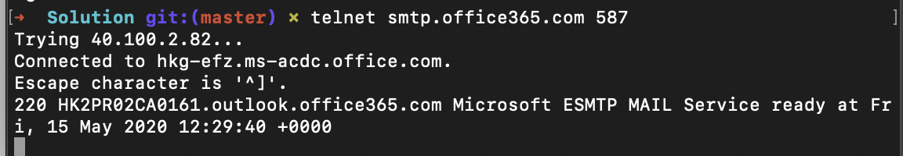
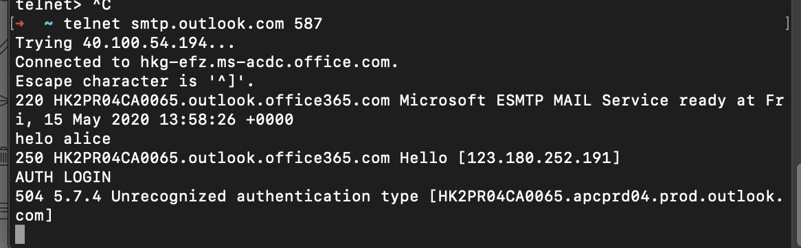
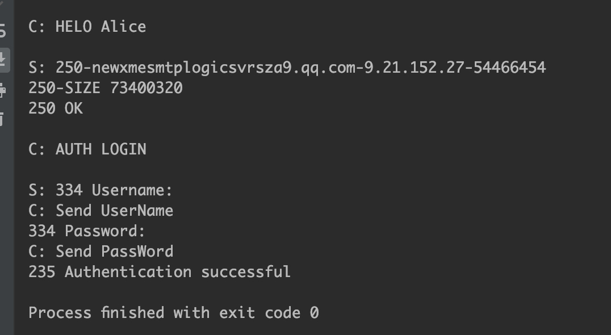
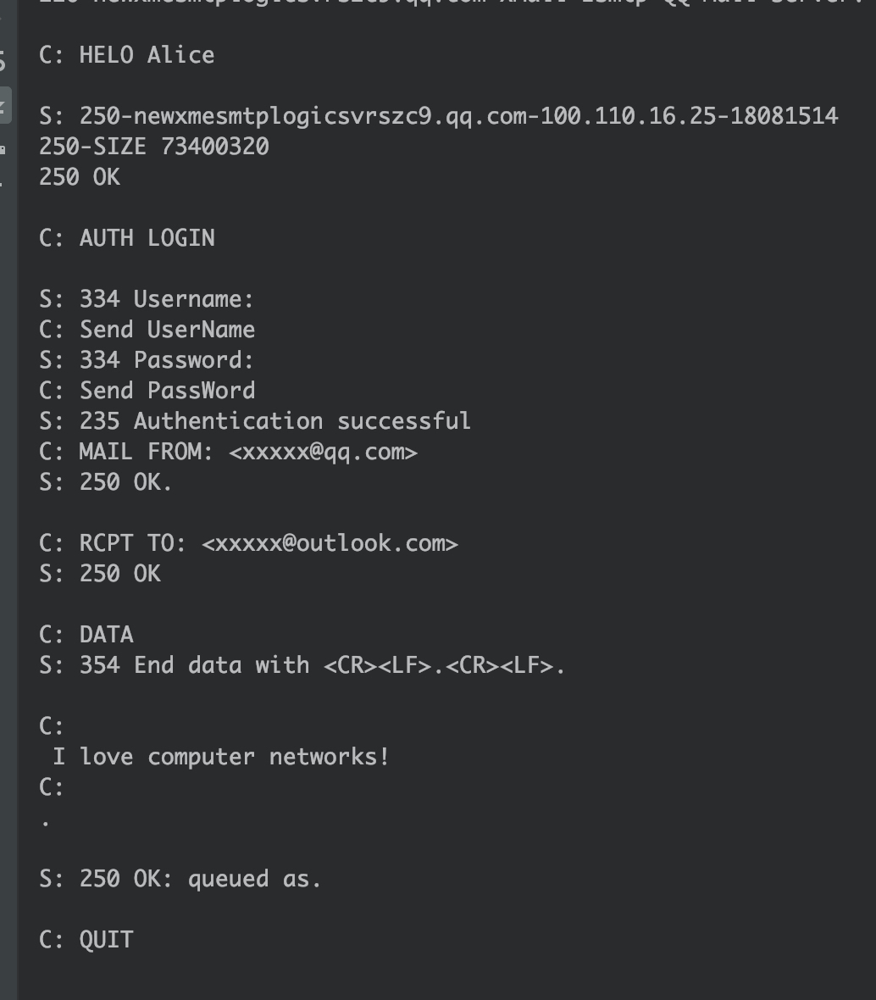
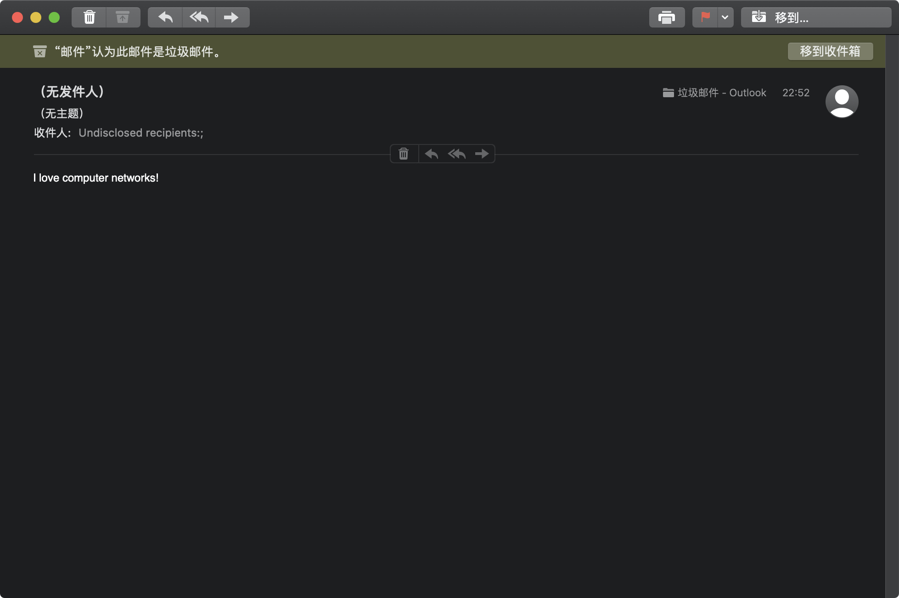

# SMTP 实验

这个实验是为了让我们理解 SMTP 协议, 木钵按时构建一个邮件客户端, 可以发送邮件到任意接收端. 邮件客户端首先需要链接到邮件的服务器, 通过 SMTP 协议与其进行通信, 然后将 E-mail 信息发送给对应的服务器. Python 本身有`smtplib` 实现这些功能. 但是本实验中我们不依赖此工具库.


# 作业原始代码

```python
from socket import *

msg = "\r\n I love computer networks!"
endmsg = "\r\n.\r\n"

# Choose a mail server (e.g. Google mail server) and call it mailserver
# Fill in start
mailserver = None
# Fill in end

# Create socket called clientSocket and establish a TCP connection with mailserver
# Fill in start
clientSocket = socket()
# Fill in end

recv = clientSocket.recv(1024)
print(recv)
if recv[:3] != '220':
    print('220 reply not received from server.')

# Send HELO command and print server response.
heloCommand = 'HELO Alice\r\n'
clientSocket.send(heloCommand)
recv1 = clientSocket.recv(1024)
print(recv1)
if recv1[:3] != '250':
    print('250 reply not received from server.')

# Send MAIL FROM command and print server response.
# Fill in start

# Fill in end

# Send RCPT TO command and print server response.
# Fill in start

# Fill in end

# Send DATA command and print server response.
# Fill in start

# Fill in end

# Send message data.
# Fill in start

# Fill in end

# Message ends with a single period.
# Fill in start

# Fill in end

# Send QUIT command and get server response.
# Fill in start

# Fill in end
```


# 分析

作业代码需要补全的部分还是挺多的, 对应书中的 2.3 节.

邮件系统由三部分组成: 用户代理 user agent, 邮件服务器 mail server 和 SMTP 协议.

发邮件的流程是: 用户代理发送到发送发的邮件服务器, 然后传到杰说道的邮件服务器, 最后发到接收方的邮箱.

可以利用 telnet先尝试一下链接 outlook 的 smtp 服务器



这里放弃了, Outlook 邮箱需要认证, 而然`AUTH LOGIN`一直出问题, 如下图所示



所以转用 qq 邮箱了, 需要提供自己的邮箱名例如`xxxx@qq.com`然后在网页版设置自己邮箱的 SMTP 授权码.两者base64 加密后依次发送. 经过一番操作终于成功了, 如下图所示:



这一步骤解决了, 就可以按照书上内容编写邮件和发送了,如下图



最后的结果是目的邮箱收到一封垃圾邮件.



# 代码

```python
from socket import *
import base64


def b64(strs):
    if not isinstance(strs, bytes):
        strs = strs.encode()
    ret = base64.b64encode(strs)
    return ret


def decodeb64(strs):
    if len(strs) != 2:
        for idx, val in enumerate(strs):
            if isinstance(val, bytes):
                strs[idx] = val.decode()
        return ' '.join(strs)
    if not isinstance(strs[1], bytes):
        strs[1] = strs[1].encode()
    strs[1] = base64.b64decode(strs[1]).decode()
    for idx, val in enumerate(strs):
        if isinstance(val, bytes):
            strs[idx] = val.decode()
    return ' '.join(strs)


msg = "\r\n I love computer networks!"
endmsg = "\r\n.\r\n"

# Choose a mail server (e.g. Google mail server) and call it mailserver
# Fill in start
# 选择 outlook STMP
# mailserver = 'smtp.office365.com'
mailserver = 'smtp.qq.com'
mailserverPort = 587
# Fill in end

# Create socket called clientSocket and establish a TCP connection with mailserver
# Fill in start
clientSocket = socket(AF_INET, SOCK_STREAM)
clientSocket.connect((mailserver, mailserverPort))
# Fill in end

recv = clientSocket.recv(1024).decode()
print(recv)

# Send HELO command and print server response.
heloCommand = 'HELO Alice\r\n'
print('C: ' + heloCommand)
clientSocket.send(heloCommand.encode())
recv = clientSocket.recv(1024).decode()
print('S: ' + recv)

# Send MAIL FROM command and print server response.
# Fill in start
authCommand = 'AUTH LOGIN\r\n'
print('C: ' + authCommand)
clientSocket.send(authCommand.encode())
recv = clientSocket.recv(1024).split()
print('S: ' + decodeb64(recv))
# USERNAME AND PASSWORD
username = 'xxxxx@qq.com'
password = 'heajxxxxxxxxxxvbchc'
desitnation = 'xxxxxx@outlook.com'

print('C: Send UserName')
clientSocket.send(b64(username) + b'\r\n')
recv = clientSocket.recv(1024).decode().split()
recv = decodeb64(recv)
print('S: ' + recv)

print('C: Send PassWord')
clientSocket.send(b64(password) + b'\r\n')
recv = clientSocket.recv(1024).decode().split()
recv = decodeb64(recv)
print('S: ' + recv)

mfCommand = 'MAIL FROM: <{}>\r\n'.format(username)
print('C: MAIL FROM: <xxxxx@qq.com>')
clientSocket.send(mfCommand.encode())
recv = clientSocket.recv(1024).decode()
print('S: ' + recv)
# Fill in end

# Send RCPT TO command and print server response.
# Fill in start

rcptCommand = 'RCPT TO: <{}>\r\n'.format(desitnation)
print('C: RCPT TO: <xxxxx@outlook.com>')
clientSocket.send(rcptCommand.encode())
recv = clientSocket.recv(1024).decode()
print('S: ' + recv)

# Fill in end

# Send DATA command and print server response.
# Fill in start
print('C: DATA')
clientSocket.send('DATA\r\n'.encode())
recv = clientSocket.recv(1024).decode()
print('S: ' + recv)
# Fill in end

# Send message data.
# Fill in start
print('C: ' + msg)
clientSocket.send(msg.encode())
# Fill in end

# Message ends with a single period.
# Fill in start
print('C:' + endmsg)
clientSocket.send(endmsg.encode())
recv = clientSocket.recv(1024).decode()
print('S: ' + recv)
# Fill in end

# Send QUIT command and get server response.
# Fill in start
print('C: QUIT')
clientSocket.send('QUIT\r\n'.encode())
recv = clientSocket.recv(1024).decode()
print('S: ' + recv)
# Fill in end
clientSocket.close()
```

