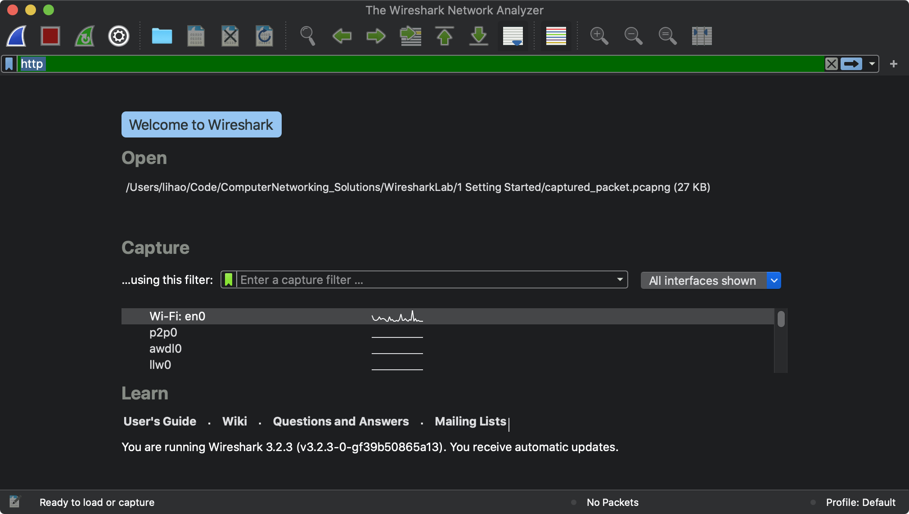
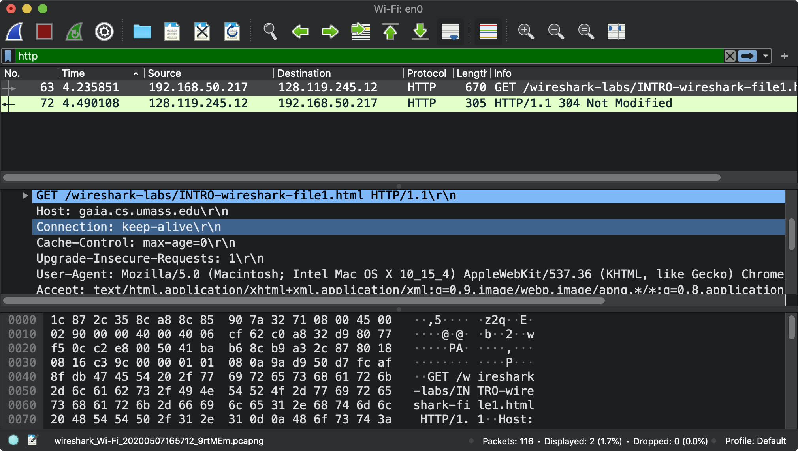
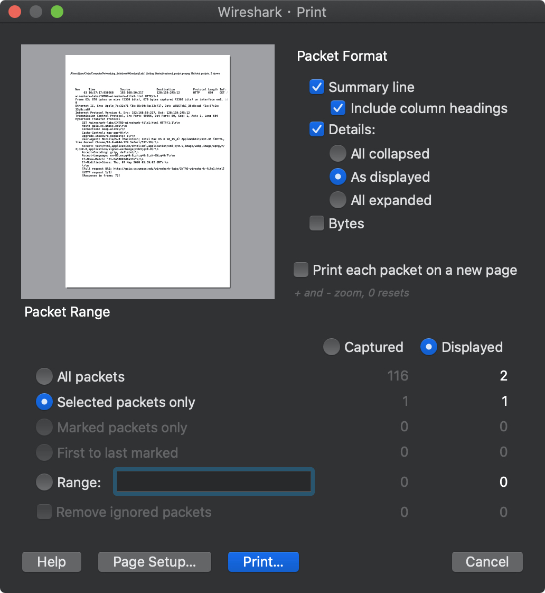

# Getting Start 学习记录

首先下载 wireshark, 我是 MacOS 在官网下载安装包.

除了安装 Wireshark, 安装包内部还有一些依赖项和将 Wireshark 加入系统路径. 操作结束后即可打开运行 Wireshark

# 初始界面



双击击`Wi-Fi: en0`开始监听, 进入监听界面


# 跟踪第一个 URL

在 Wireshark 开始抓包(packet capture)的时候, 在浏览器输入

http://gaia.cs.umass.edu/wireshark-labs/INTRO-wireshark-file1.html

然后通过 HTTP 标签过滤出对 HTTP协议包的计息结果, 结果如图



GET 对应的数据报如下

```
Hypertext Transfer Protocol
    GET /wireshark-labs/INTRO-wireshark-file1.html HTTP/1.1\r\n
    Host: gaia.cs.umass.edu\r\n
    Connection: keep-alive\r\n
    Cache-Control: max-age=0\r\n
    Upgrade-Insecure-Requests: 1\r\n
    User-Agent: Mozilla/5.0 (Macintosh; Intel Mac OS X 10_15_4) AppleWebKit/537.36 (KHTML, like Gecko) Chrome/81.0.4044.129 Safari/537.36\r\n
    Accept: text/html,application/xhtml+xml,application/xml;q=0.9,image/webp,image/apng,*/*;q=0.8,application/signed-exchange;v=b3;q=0.9\r\n
    Accept-Encoding: gzip, deflate\r\n
    Accept-Language: en-US,en;q=0.9,zh;q=0.8,zh-CN;q=0.7\r\n
    If-None-Match: "51-5a50893dfa37e"\r\n
    If-Modified-Since: Thu, 07 May 2020 05:59:02 GMT\r\n
    \r\n
    [Full request URI: http://gaia.cs.umass.edu/wireshark-labs/INTRO-wireshark-file1.html]
    [HTTP request 1/1]
    [Response in frame: 72]

```

服务器返回的数据报如下

```
Hypertext Transfer Protocol
    HTTP/1.1 304 Not Modified\r\n
    Date: Thu, 07 May 2020 08:57:17 GMT\r\n
    Server: Apache/2.4.6 (CentOS) OpenSSL/1.0.2k-fips PHP/5.4.16 mod_perl/2.0.11 Perl/v5.16.3\r\n
    Connection: Keep-Alive\r\n
    Keep-Alive: timeout=5, max=100\r\n
    ETag: "51-5a50893dfa37e"\r\n
    \r\n
    [HTTP response 1/1]
    [Time since request: 0.254257000 seconds]
    [Request in frame: 63]
    [Request URI: http://gaia.cs.umass.edu/wireshark-labs/INTRO-wireshark-file1.html]

```

我将结果保存在了`captured_packet.pcapng`这里, 可以从 Wireshark 里面打开这个文佳回复当时的抓包.

# 其他作业题

>List 3 different protocols that appear in the protocol column in the unfiltered packet-listing window in step 7 above.

MDNS, TCP, SSDP, ARP, STP,  ICMP

> How long did it take from when the HTTP GET message was sent until the HTTP OK reply was received? (By default, the value of the Time column in the packetlisting window is the amount of time, in seconds, since Wireshark tracing began. To display the Time field in time-of-day format, select the Wireshark View pull down menu, then select Time Display Format, then select Time-of-day.)


> What is the Internet address of the gaia.cs.umass.edu (also known as wwwnet.cs.umass.edu)? What is the Internet address of your computer?

192.169.50.217

128.119.245.12

> Print the two HTTP messages (GET and OK) referred to in question 2 above. To do so, select Print from the Wireshark File command menu, and select the “Selected Packet Only” and “Print as displayed” radial buttons, and then click OK.

