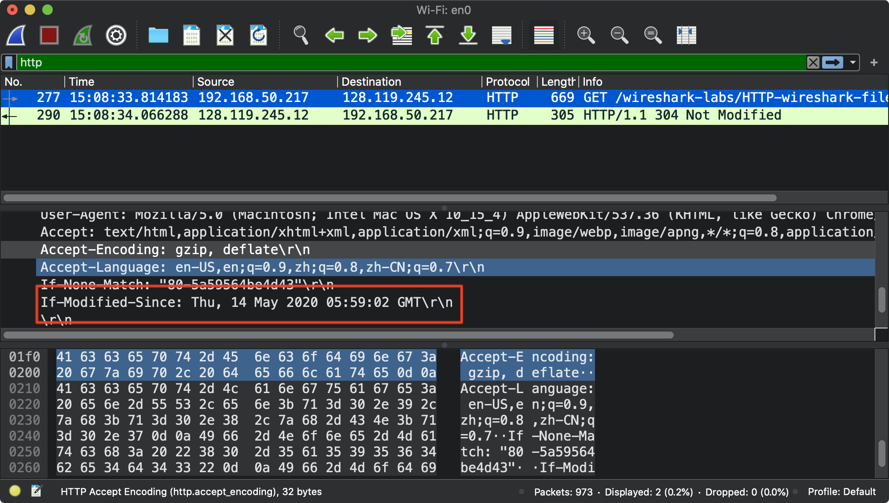

# HTTP 学习记录

本实验包含以下几个部分:

1. 基本的 GET/Response 交互
2. HTTP 报文格式
3. 检索 (retrieving) 大的 HTML 文件或者包含嵌入式对象的文件
4. HTTP 认证和安全等

该实验内容和书中2.2 节密切相关

# 基本的 HTTP GET/response 交互

这里我不清楚是否是 VPN 的问题,按照要求操作了好多遍, 才成功抓到对应 IP 的包.

作者给了网址http://gaia.cs.umass.edu/wireshark-labs/HTTP-wireshark-file1.html 可以先用过域名解析网站, 将网址解析成 IP 然后再从抓包软件找对应 IP 相关的包


可以看到, 收到了 2 个 HTTP 报文, 分别是`GET`和`response`

注意`response`收到的报文是`304 Not Modified`我们之前访问过该网址, 因此有缓存.

根据网络的分层模型, HTTP 发送的是时候会通过应用层/传输层/网络层等,因此截图会显示不同层的协议等.


关于这部分, 实验给出了几个问题:

**1.Is your browser running HTTP version 1.0 or 1.1? What version of HTTP is the server running?**


如上图, 我的浏览器使用的是`HTTP/1.1`

服务器回应的也是`HTTP/1.1`

```http
HTTP/1.1 304 Not Modified\r\n
```

两个都是 `http 1.1`协议


**2.What languages (if any) does your browser indicate that it can accept to the server?**

```http
Accept-Language: en-US,en;q=0.9,zh;q=0.8,zh-CN;q=0.7
```

在请求header 中有如上字段. 

这里有一个`q=0.x`表示的是 Quality values

`zh`是中文,代表的是宏语言(Macrolanguage), 可以是中文/方言/繁体混合内容

`zh-CN`表示的是中国大陆中文, 包含方言和繁体, 默认简体普通话

参考网址为 [Mozilla 的手册](https://developer.mozilla.org/en-US/docs/Web/HTTP/Headers/Accept-Language)


**3.What is the IP address of your computer? Of the gaia.cs.umass.edu server?**

本机的地址是 `192.168.50.217` 是局域网 IP

请求的目的 IP 是`128.119.245.12`


**4.When was the HTML file that you are retrieving last modified at the server?**

这个需要查`GET` 和`response`的 报文



在`GET`中, 询问是`If-Modified-Since: Thu, 14 May 2020 05:59:02 GMT\r\n` 就是在这之后是否有修改, 如上图. 下图是服务器的回应


说明没有修改, 可以使用之前缓存的文档.

如果删除缓存, 才能在`200 OK`状态码后面查到上一次的修改时间.

总之, 这次的修改时间是一个相对的修改时间, 即这次上查询和上次查询这段时间内, 网页没有更改, 所以直接读缓存了


**6. How many bytes of content are being returned to your browser?**

查看`Length`这一项即可,如下图


**7.By inspecting the raw data in the packet content window, do you see any headers within the data that are not displayed in the packet-listing window? If so, name one.**

这个意思好像是网页是否显示的内容和 HTTP 报文的内容相同, 是否存在报文中没有显示的东西. 我不清楚是不是因为有缓存, 我没有在报文里面找到页面相关的`data`数据

>在上面对问题5的回答中，您可能会惊讶地发现刚刚检索的文档在下载文档之前一分钟之内被最后一次修改。这是因为（对于该特定文件），gaia.cs.umass.edu服务器将文件的上次修改时间设置为当前时间，并且每分钟执行一次。因此，如果您在两次访问之间等待一分钟，则该文件似乎已被最近修改，因此您的浏览器将下载该文档的“新”副本。


# HTTP CONDITIONAL GET/response interaction

实验前一定要先把浏览器缓存清了. 然后打开浏览器和分组嗅探器.

然后快速请求两次网址

http://gaia.cs.umass.edu/wireshark-labs/HTTP-wireshark-file2.html

截图如下:


然后回答问题如下

**8.Inspect the contents of the first HTTP GET request from your browser to the server. Do you see an “IF-MODIFIED-SINCE” line in the HTTP GET?**


第一次`GET` 没有`IF-MODIFIED-SINCE`, 回应报文状态码为`200 Ok`

第二次`GET`如图:


多了对应字段, 回应报文的状态码为`304`


**9.Inspect the contents of the server response. Did the server explicitly return the contents of the file? How can you tell?**

实际上是询问服务器是否页面发生改变, 服务器返回未发生改变, 因此直接加载本地的缓存即可. 所以服务器没有直接返回页面的`data`数据, 而是给出状态码`304`


**10.Now inspect the contents of the second HTTP GET request from your browser to the server. Do you see an “IF-MODIFIED-SINCE:” line in the HTTP GET? If so, what information follows the “IF-MODIFIED-SINCE:” header?**

后面跟的是第一次`200 OK`状态码下面`Last-Modified`的时间


**11.What is the HTTP status code and phrase returned from the server in response to this second HTTP GET? Did the server explicitly return the contents of the file? Explain.**

`304` 当然没有了, 因为没有发生改变, 所以直接调用缓存


# 检索长文档

同理, 清缓存, 然后访问实验提供的网址

http://gaia.cs.umass.edu/wireshark-labs/HTTP-wireshark-file3.html

HTTP`response`应该是对应的长文件(Bill of Rights人权法案), 但是由于文件过大, 需要被 TCP 切割成多个段来传输, 如下图所示


问题如下

**12.How many HTTP GET request messages did your browser send? Which packet number in the trace contains the GET message for the Bill or Rights?**

`GET`只发送了一个


如图, 第 194 个包包含了对Bill of Rights 的请求


**13.Which packet number in the trace contains the status code and phrase associated with the response to the HTTP GET request?**

对应的应该是第 204个 Packat


**14.What is the status code and phrase in the response?**

`HTTP/1.1 200 OK`


**15.. How many data-containing TCP segments were needed to carry the single HTTP response and the text of the Bill of Rights?**


应该是 4 个,如下图


# 包含嵌入式对象的 HTML 文档

同理, 清缓存, 然后访问网址

http://gaia.cs.umass.edu/wireshark-labs/HTTP-wireshark-file4.html

该网址包含为一个简单的 HTML 文件包含 2 个图片, 网址如下图


抓包结果如下图, 可以看到, 浏览器在收到原来的 HTML 响应后,还会请求嵌入式的对象,即发送 2 个请求, 另外一个请求我这里截图比较早,还没有收到回应


回答如下问题

**16.How many HTTP GET request messages did your browser send? To which Internet addresses were these GET requests sent?**

可以看到有 3 个请求, 对应的 IP 如下

```
128.119.245.12
128.119.245.12
128.119.245.12
```

**17,Can you tell whether your browser downloaded the two images serially, or whether they were downloaded from the two web sites in parallel? Explain.**

不是并行处理的, 从截图可以看到, 发送时间还是存在时间差的. 应该是顺序请求的


# HTTP Authentication

清缓存, 访问如下网址, 和上面操作一样, 不同的是这个网站带有密码保护需要验证.

网址如下

http://gaia.cs.umass.edu/wireshark-labs/protected_pages/HTTP-wiresharkfile5.html

抓包结果如下:


输入的用户名和密码是 Base64 个是的,但是没有加密. 回答问题如下

**18.What is the server’s response (status code and phrase) in response to the initial HTTP GET message from your browser?**

第一次的状态码是

```
401 Unauthorized
```


**19.When your browser’s sends the HTTP GET message for the second time, what new field is included in the HTTP GET message?**


加入了`Authorization`字段通过 Base64 编码

