# DNS 学习记录

本实验对应自顶向下方法 2.4 节

DNS(Domain Name System) 提供域名解析服务.

# nslookup

**nslookup** 在多数 Unix/Linux/Windows 平台都可以使用, 只需要终端输入

```shell
nslookup
```

他可以发送 DNS 查询并接受和显示 DNS 服务器(根/顶级域/权威/临时的)的响应.

例如输入, 

```shell
nslookup www.mit.edu
```

返回结果如下:

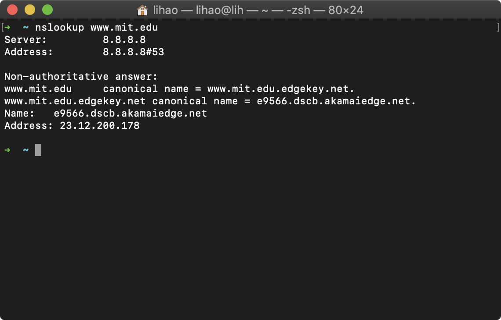

其中 `8.8.8.8`为默认的本地 DNS 服务器地址.  注意的是本地 DNS 服务器在解析域名的时候可能与其他 DNS 服务器交互.


下面输入第二条命令

```shell
nslookup -type=ns mit.edu
```

`tpye=ns` 表示查找权威的 DNS 主机名, 如果不使用则默认查询 A 类记录, 详见书 2.4.3 节

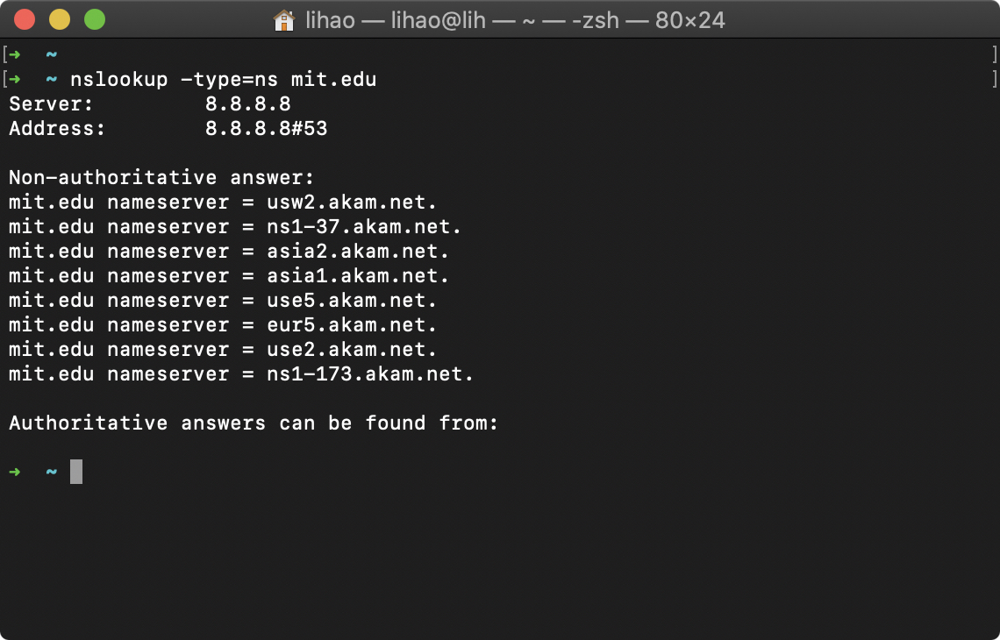


下面输入第三条命令:

```shell
nslookup www.aiit.or.kr bitsy.mit.edu
```

这个例子知名想要从`bitsy.mit.edu` 这个DNS 服务器查询而不是从默认的 DNS 服务器查询

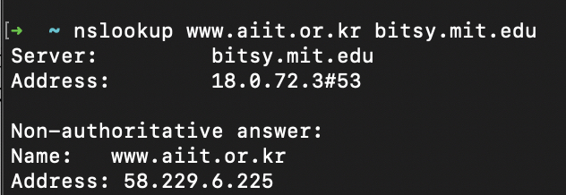


可以总结 nslookup 语法为

```shell
nslookup -option1 -option2 host-to-find dns-server
```

下面需要完成 3 个任务:

> 运行 nslookup 并对亚洲的web 服务器查询 ip

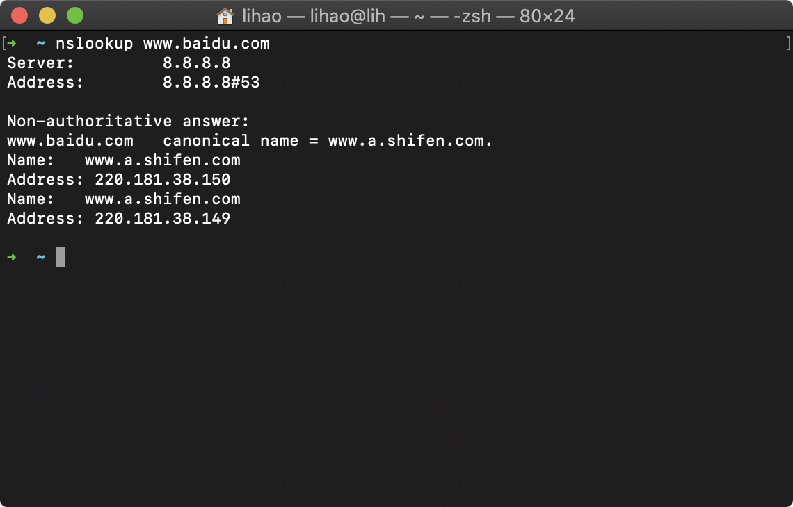

如图百度找到 2 个 IP 地址, 分别为 220.181.38.150 和 220.181.38.149

> 运行 nslookup 并确定欧洲学校的权威域名服务器

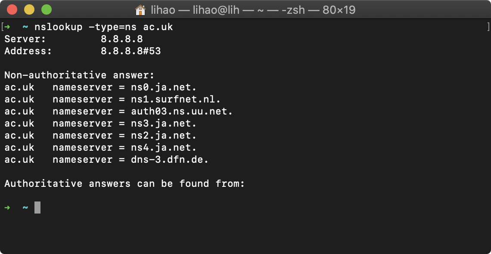

如图查找 Oxford 大学该域主机 IP 地址的权威 DNS 服务器主机名, 然而返回的都是未经认证的 DNS 服务器地址.

> 运行 nslookup 使用问题 2 中已有的 DNS 服务器, 查询雅虎邮件服务器地址

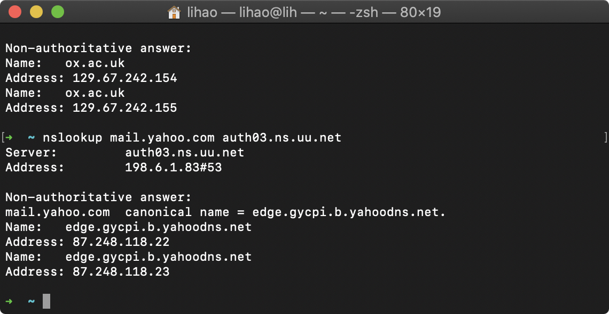

如图.


# ipconfig

windows 为*ipconfig*, Linux/MaxOS 为*ifconfig*

该命令可以用于显示 TCP/IP 信息, 包括本机地址,DNS 服务器地址, 适配器类型等. 我的电脑是 MacOS 两个命令差距有点大, 这里跳过


# Tracing DNS with Wireshark

首先需要清除 DNS 缓存, windows 使用 ipconfig, MacOS 输入以下命令, 详见[参考网址](https://phoenixnap.com/kb/how-to-flush-dns-cache)

```shell
sudo killall -HUP mDNSResponder; say dns cleared successfully
```

然后打开浏览器, 清空浏览器缓存.

最后打开 Wireshark, 在过滤菜单输入`ip.addr == yout_IP_address` , 首先需要用 ipconfig 获取 ip 地址. 然后开始抓包.

在浏览器中输入访问http://www.ietf.org

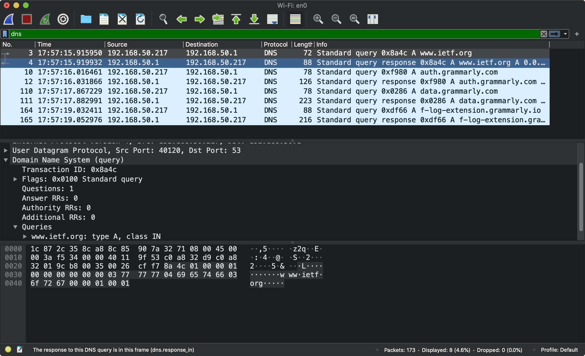

> Locate the DNS query and response messages. Are then sent over UDP or TCP?

UDP, 可以看到协议是 User Datagram Protocol

> What is the destination port for the DNS query message? What is the source port of DNS response message?

本地 Port 40120, 目的 Port 53

> To what IP address is the DNS query message sent? Use ipconfig to determine the IP address of your local DNS server. Are these two IP addresses the same?

我这里用的路由器本地 DNS 192.168.50.1, 源地址为本机的地址 192.168.50.217

> Examine the DNS query message. What “Type” of DNS query is it? Does the query message contain any “answers”?

Type A, 未包含 ansewers


我后来又抓包了访问 www.qq.com时 DNS 服务数据包, 因为原始的网址不挂 VPN 无法访问. 如下图

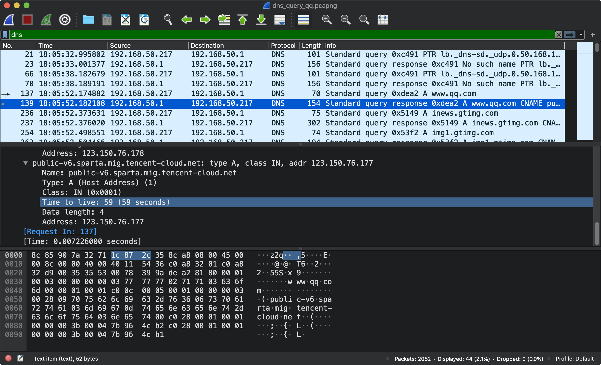

> Examine the DNS response message. How many “answers” are provided? What do each of these answers contain?

对于查 qq, answers 数量不固定, 如图所示

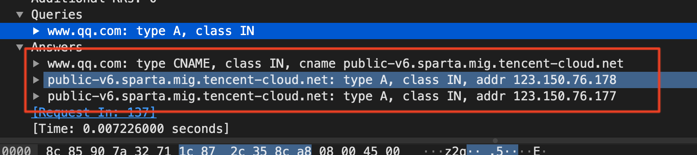

> Consider the subsequent TCP SYN packet sent by your host. Does the destination IP address of the SYN packet correspond to any of the IP addresses provided in the DNS response message?

如下图, 随后根据 DNS 返回的 IP 地址建立 TCP 连接, IP 地址为123.150.76.178, 同时`SYN` 进行三次握手


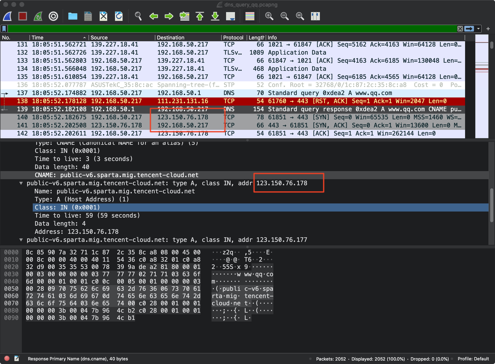


> This web page contains images. Before retrieving each image, does your host issue new DNS queries?

对于 www.qq.com, 是的, 需要发起 DNS 请求得到图片缓存网址的 IP 信息

# Play with nslookup

## nslookup

1. 开始抓包

2. ```shell
   nslookup www.mit.edu
   ```

3. 停止抓包

抓包结果如下图:

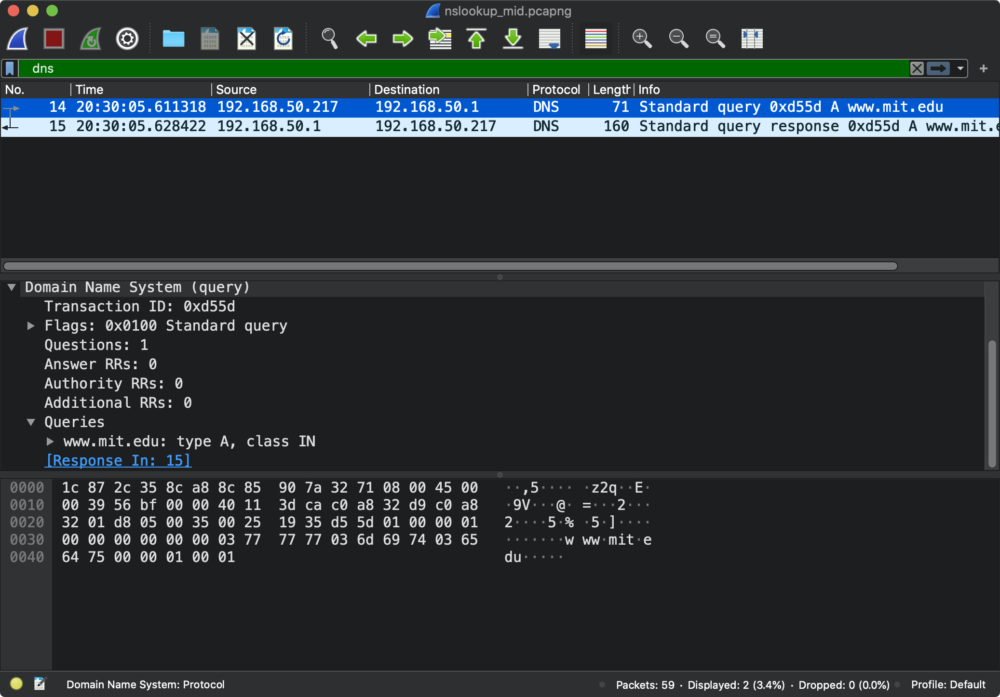

> What is the destination port for the DNS query message? What is the source port of DNS response message?

Src: 55301 Dst: 53

> To what IP address is the DNS query message sent? Is this the IP address of your default local DNS server?

`192.168.50.1`  没错是默认本地 DNS 服务器地址

> Examine the DNS query message. What “Type” of DNS query is it? Does the query message contain any “answers”?

Type A(host address) 一条 A 类型的资源记录提供了标准的主机名到 IP 地址的映射. 查询报文没有包含任何 answers

> Examine the DNS response message. How many “answers” are provided? What do each of these answers contain?

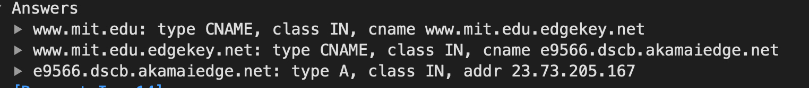

如图有 3 个. 对应含义在书中 2.4.3

## nslookup -type=ns

下面在重复实验, 但是需要加上 type=ns

```shell
nslookup -type=ns mit.edu
```

如图所示

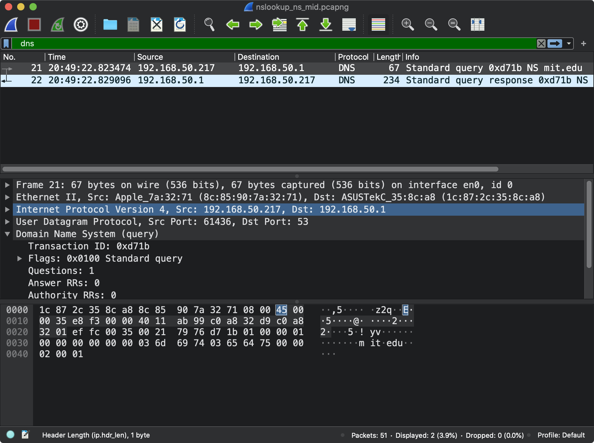

> To what IP address is the DNS query message sent? Is this the IP address of your default local DNS server?

分别是源地址192.168.50.217和 DNS 服务器地址 192.168.50.1

> Examine the DNS query message. What “Type” of DNS query is it? Does the query message contain any “answers”?

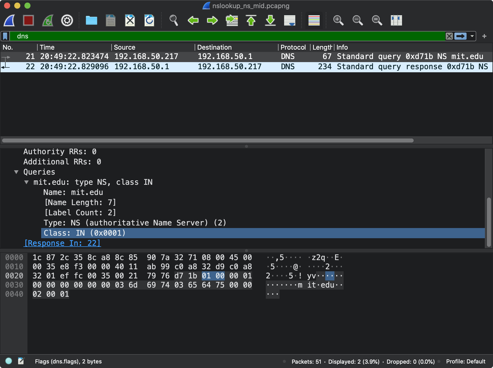

如图, 没有 answers, type 为 NS

ns 查询的 Name 是个 domain,  Value 是个知道如何获得该域中主机 IP 地址权威 DNS 服务器的主机名.

> Examine the DNS response message. What MIT nameservers does the response message provide? Does this response message also provide the IP addresses of the MIT namesers?

提供了很多个 answers, 表示权威 DNS 服务器的主机名

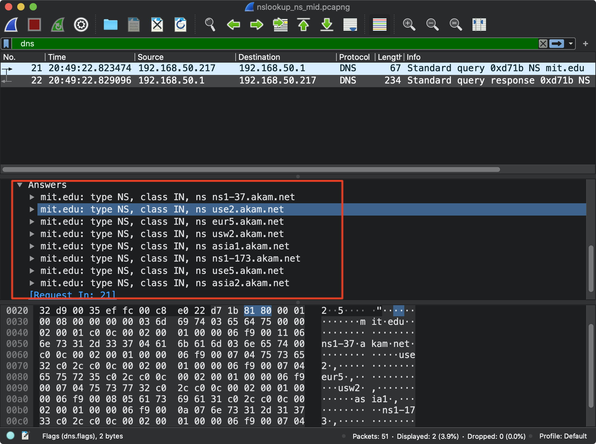

## nslookup with DNS server

```shell
nslookup www.aiit.or.kr bitsy.mit.edu
```

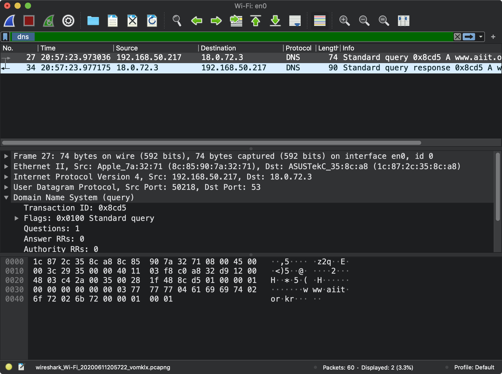

> To what IP address is the DNS query message sent? Is this the IP address of your default local DNS server? If not, what does the IP address correspond to?

DNS 服务器地址变为18.0.72.3 这不是本地的 DNS 地址

> Examine the DNS query message. What “Type” of DNS query is it? Does the query message contain any “answers”?

type A, 没有

> Examine the DNS response message. How many “answers” are provided? What does each of these answers contain?

1个answer: Name, type, class , ttl(Time to live), data length, address

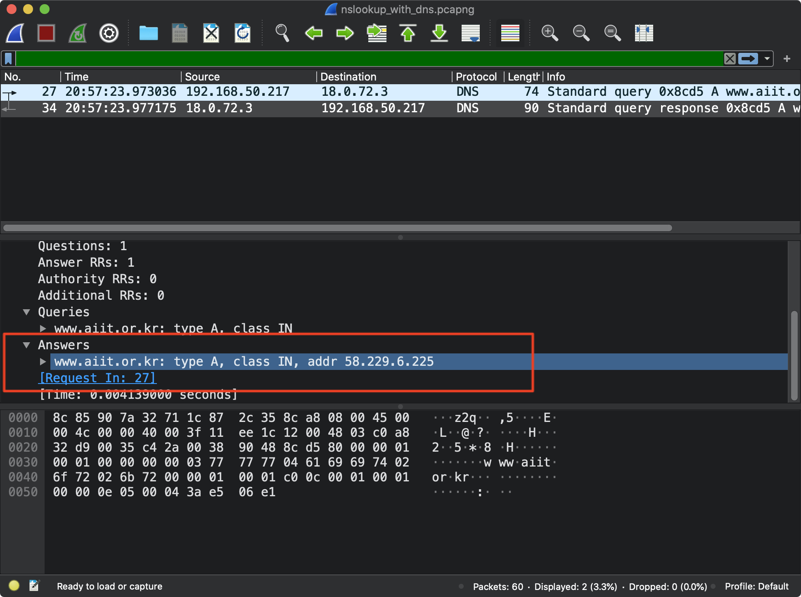