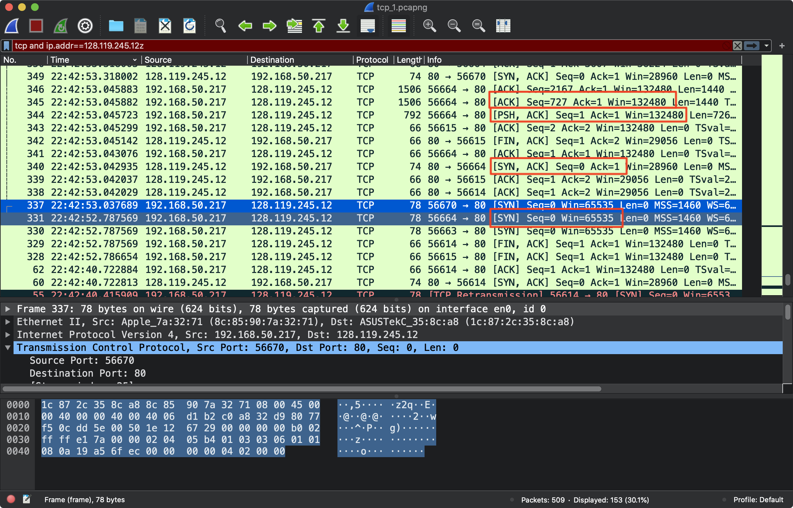
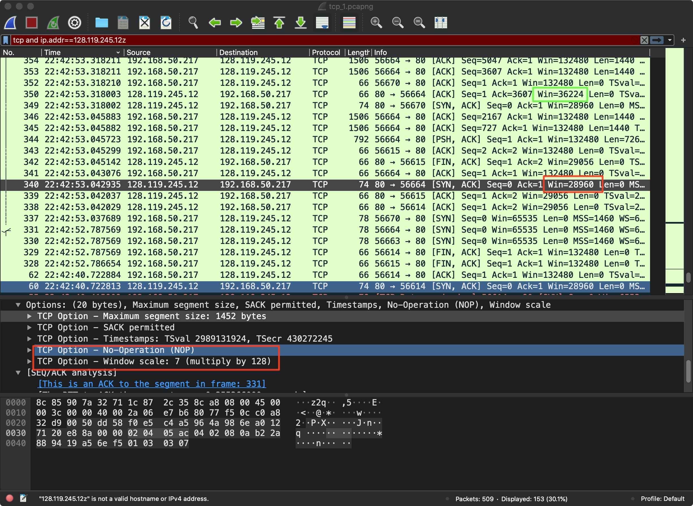
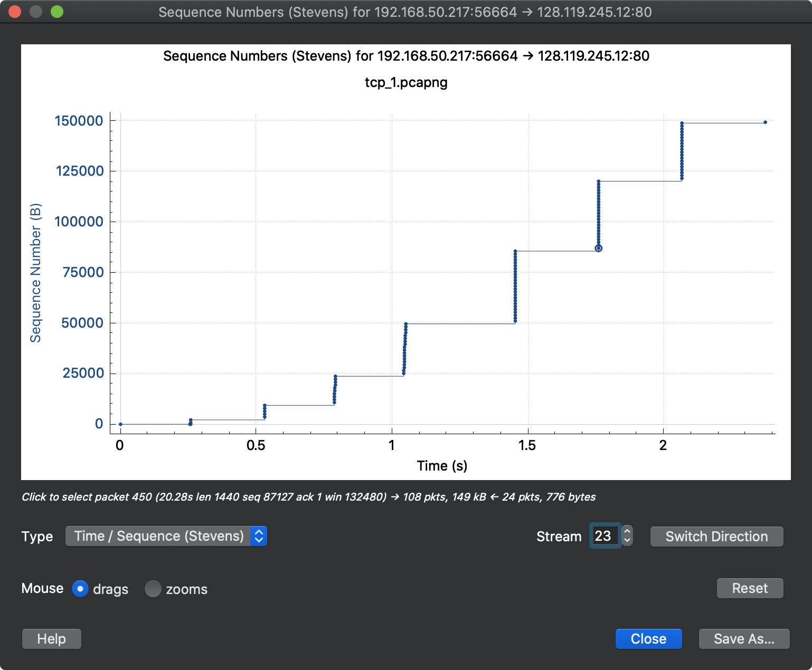
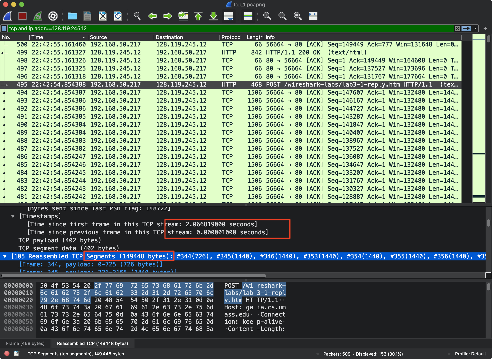
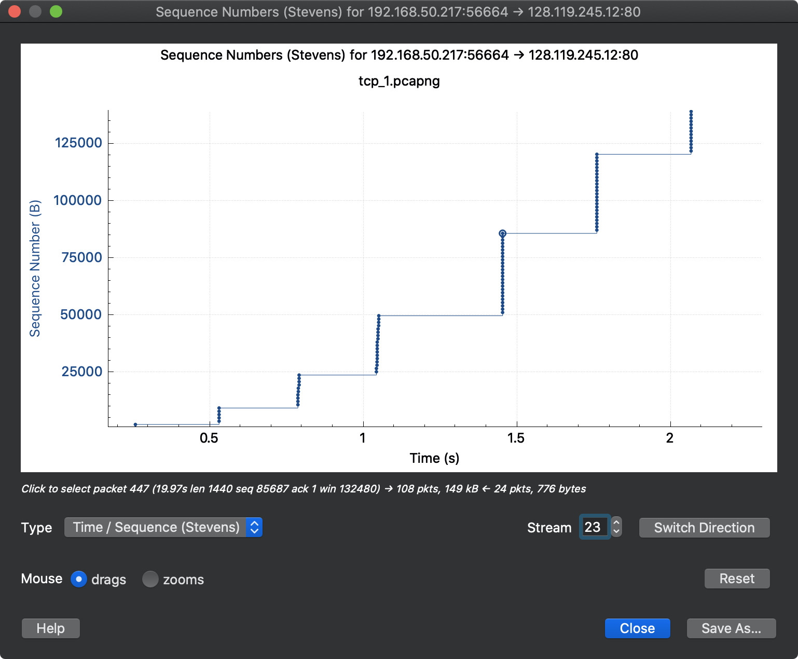

# TCP 学习记录

本实验通过跟踪 TCP 报文,接受一个 150KB 的爱丽丝梦游仙境文档. 可以学习 TCP slow start + congestion avoidance, 流量控制机制等. 相关内容在书3.5 和 3.7 节

# Capturing a bulk TCP transfer from your computer to a remote server

首先通过 Wireshark 获得 TCP 传输过程中的数据报. 然后通过调用 Http POST 方法,将本地的数据传到其他电脑. 具体操作过程如下:

1. 打开浏览器, 访问http://gaia.cs.umass.edu/wiresharklabs/alice.txt, 将其保存在本地
2. 访问 http://gaia.cs.umass.edu/wireshark-labs/TCP-wireshark-file1.html.
3. 点击 Browse 按钮, 将下载的 alice.txt 上传到改服务器, 如果成功上传会有一个 congratulation信息
4. 停止 Wireshark 抓包.

抓包过程中信息有点多, 可以先用 uslookup 定位 gaia.cs.umass.edu 的 IP 地址. 抓包结果如下图


# 分析抓包内容


> What is the IP address and TCP port number used by the client computer (source) that is transferring the file to gaia.cs.umass.edu? To answer this question, it’s probably easiest to select an HTTP message and explore the details of the TCP packet used to carry this HTTP message, using the “details of the selected packet header window” (refer to Figure 2 in the “Getting Started with Wireshark” Lab if you’re uncertain about the Wireshark windows.

Source`192.168.50.217:56664` Dst`128.119.245.12:80`

如截图所示, 本机使用 POST 传输数据


# TCP 基础

> What is the sequence number of the TCP SYN segment that is used to initiate the TCP connection between the client computer and gaia.cs.umass.edu? What is it in the segment that identifies the segment as a SYN segment?


本机想目的服务器发送 SYN , 第一次握手, 本机端口为 56664, 狂口大小 Win=65535

注意sequence number分为原始和相对, raw 为 2521479185, relative 为 0,

服务器返回 SYN/ACK, ack raw 2521479816, relative 1, 同时发送自己的 sequencenumber 为 0, raw 为4041589925

> What is the sequence number of the SYNACK segment sent by gaia.cs.umass.edu to the client computer in reply to the SYN? What is the value of the Acknowledgement field in the SYNACK segment? How did gaia.cs.umass.edu determine that value? What is it in the segment that identifies the segment as a SYNACK segment?

回应的 ACK 为客户端 SEQ + 1, 然后出了 ACK , 由于第二次握手,因此 SYN 置 1, 同时随机化一个 SEQ number 4041589925.

> What is the sequence number of the TCP segment containing the HTTP POST command? Note that in order to find the POST command, you’ll need to dig into the packet content field at the bottom of the Wireshark window, looking for a segment with a “POST” within its DATA field.


如图, 我们需要找到 TCP 报文, 发现在 PSH 位置 1 的时候有一个TCP 报文的 data 部分包含 POST

```
Sequence number: 1    (relative sequence number)
Sequence number (raw): 2521471086
[Next sequence number: 727    (relative sequence number)]
Acknowledgment number: 1    (relative ack number)
Acknowledgment number (raw): 4041589926
```

next SEQ 是 length +SEQ, 1 + 726 = 727

> Consider the TCP segment containing the HTTP POST as the first segment in the TCP connection. What are the sequence numbers of the first six segments in the TCP connection (including the segment containing the HTTP POST)? At what time was each segment sent? When was the ACK for each segment received? Given the difference between when each TCP segment was sent, and when its acknowledgement was received, what is the RTT value for each of the six segments? What is the EstimatedRTT value (see Section 3.5.3, page 242 in text) after the receipt of each ACK? Assume that the value of the EstimatedRTT is equal to the measured RTT for the first segment, and then is computed using the EstimatedRTT equation on page 242 for all subsequent segments.
>
> 将包含HTTP POST的TCP段视为TCP连接中的第一段。 TCP连接中的前六个段（包括包含HTTP POST的段）的序列号是什么？每个分段在什么时间发送？何时收到每个段的ACK？给定发送每个TCP段的时间与接收到它的确认之间的时间差，六个段中每个段的RTT值是多少？收到每个ACK之后，估计RTT值是多少（请参见文本第242页，第3.5.3节）？假设EstimatedRTT的值等于第一段的测量RTT，然后使用第242页上的EstimatedRTT公式对所有后续段进行计算。


wireshark 可以帮忙算: Note: Wireshark has a nice feature that allows you to plot the RTT for each of the TCP segments sent. Select a TCP segment in the “listing of captured packets” window that is being sent from the client to the gaia.cs.umass.edu server. Then select: Statistics->TCP Stream Graph-Round Trip Time Graph.


> What is the length of each of the first six TCP segments?


如图, 红框显示了 TCP 报文的大小, 这里需要更正, TCP 报文 data大小通过 SEQ number 计算出来的, TCP 序列号建立在传送的字节流之上,(对应 TCP 报文数据段的大小) SEQ number 是报文段首字节的字节流编号. 第一个 SEQ = 0, 第二个SEQ = 1, 第三个 SEQ=727, 所以第二个 data 报文有 726 字节的数据.



> What is the minimum amount of available buffer space advertised at the received for the entire trace? Does the lack of receiver buffer space ever throttle the sender?

注意 Wireshark 有 windows size 和 calcultaed windows size

> 由于 TCP 的头部窗口字段只有 16bit，最多表示 64k, 为了表示更大的窗口，使用了可选的放大倍数。
>
> 1. 在 TCP 三次握手的时候在 SYN 或 SYN,ACK 包中，通知 options 可选信息，告知对方将使用放大倍数。
>
> 2. SYN 本身不放大
>
> 3. 所以 window size value 表示报文的值，calculated window size 表示放大后的值，也就是实际可用的值，
>
> 这个值应该是 wireshark 为了友好，自己算出来了

如图, 开始 28960bytes. TCP 通过让发送方维护一个接受窗口的变量提供流量控制服务. 每次发送报文的时候通知其缓存还有多少可用空间, 比如出事的时候是 28960bytes. 接受方 A 收到 B 的可用 buffer, 并跟踪 A 上次一发出的 byte 和上一次从 B 接受的 ack 的 byte号, 让他们始终在 B 的可用空间范围内实现拥塞控制. 显然如果缺失了 receiver buffer space, 无法实现拥塞控制.



> Are there any retransmitted segments in the trace file? What did you check for (in the trace) in order to answer this question?

通过软件可以统计 sequence numbers 发现没有重传



> How much data does the receiver typically acknowledge in an ACK? Can you identify cases where the receiver is ACKing every other received segment (see Table 3.2 on page 250 in the text).

对应P163 产生 TCP-ACK 的建议. 如果比期望序列号大的报文段到达, 接受方立即发送冗余 ACK, 发送方收到 3 个冗余 ACK 执行快速重传机制.如图应该是没有冗余 ACK 的.


> What is the throughput (bytes transferred per unit time) for the TCP connection?
>
> Explain how you calculated this value.

throughput 吞吐量= 数据传输大小/时间, 直接看 HTTP POST, 总共耗时 2.06s, 相关 TCP 报文 149448bytes.



# TCP congestion control in action

> Select a TCP segment in the Wireshark’s “listing of captured-packets” window.

Then select the menu : Statistics->TCP Stream Graph-> Time-SequenceGraph(Stevens). You should see a plot that looks similar to the following plot, which was created from the captured packets in the packet trace tcp-etherealtrace-1 in http://gaia.cs.umass.edu/wireshark-labs/wireshark-traces.zip (see earlier footnote )



> Use the Time-Sequence-Graph(Stevens) plotting tool to view the sequence number versus time plot of segments being sent from the client to the gaia.cs.umass.edu server. Can you identify where TCP’s slowstart phase begins and ends, and where congestion avoidance takes over? Comment on ways in which the measured data differs from the idealized behavior of TCP that we’ve studied in the text.


慢启动如图, 是指数级别增长. 当检测到拥塞的时候, 进入拥塞避免(拥塞窗口减小到发生拥塞时的一半)